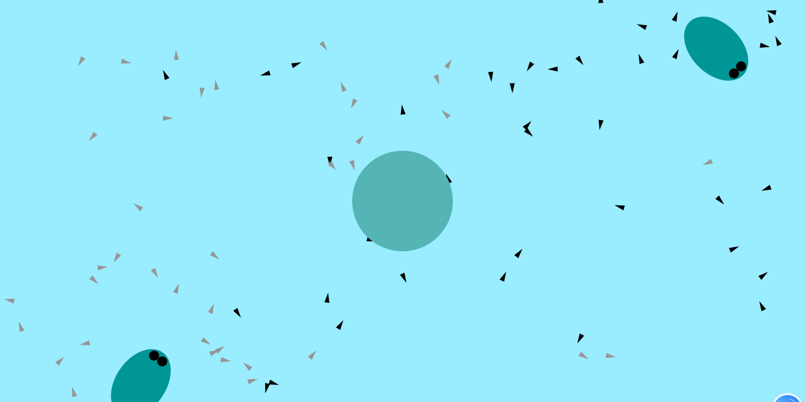
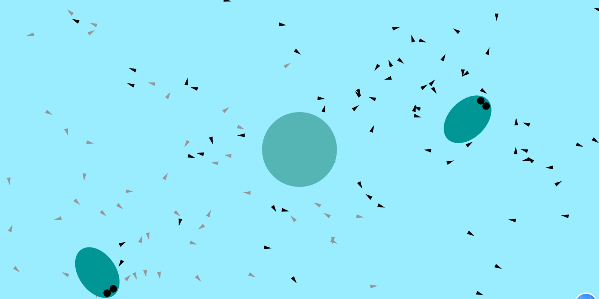
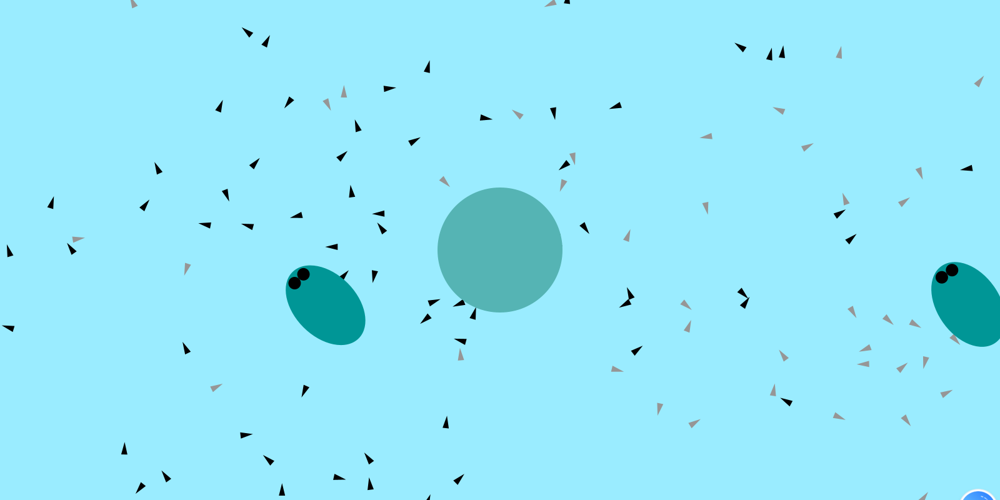

## Description
This assignment is to simulate an ecosystem using the concepts we learn from chapters of <The Nature of Code>. In the virtual ecosystem, there are a number of computational creations that swim in a pond,and inteact with each other with a set of rules. 
I put three main creatures in my pond, which are frogs, tadpoles, and the algae. Here are the rules I set for my ecosystem:
  - Frogs attract the tadpoles. Frogs move slowly at first, then accelerate. When the velocity reaches a certain limit, the frogs will stop and restart moving, which simulates how frogs swim in the real life. Frogs will change their directions when reach the edge of the pond. 
  - Algae is the food source which also attracts the small tadpoles that need food to grow. I make the mass of the algae so much larger than the frog to make the attractiveness of food higher than the frog. 
  - There are two groups of tadpoles with different colors. Each group follows one frog, and they are all work as predators that are attracted by the algae in the middle of the pond. The tadpoles will repel the tadpoles with different colors. 
  - The hunger level of each tadpoles determines how fast the tadpoles move. More hungry the tadpole is, the faster it moves.
  - I try to make use of the concept of particles to build a lifespan for each tadpole, but due to my lack of experience in managing the boolean statement, I fail to accomplish this goal. This is what I could improve for this project in the future.
## Screenshots

