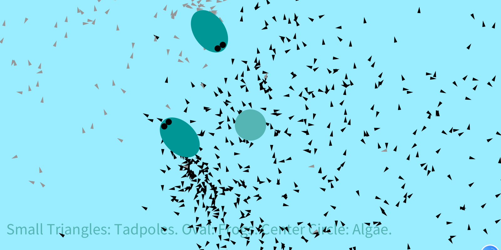

## 2.27
- Based on my previous project, I make a change that instead of having the tadpoles at the very beginning, the tadpoles occur where the frogs are one by one. 
This change is made to imitate the process of a frog bearing tadpoles. I realize this by putting the "tadpoles.add" in the draw function, and make the location same as the frog's location. 
I try to set up the lifespan and let the tadpoles disappear after a certain period of time. However, I fail to give out a workable boonlean statement to judge whether the tadpoles die, which is what I will work on for the future progress.
- Here is the picture:

  [Link to video](https://youtu.be/V4nKdK6XWYc)
