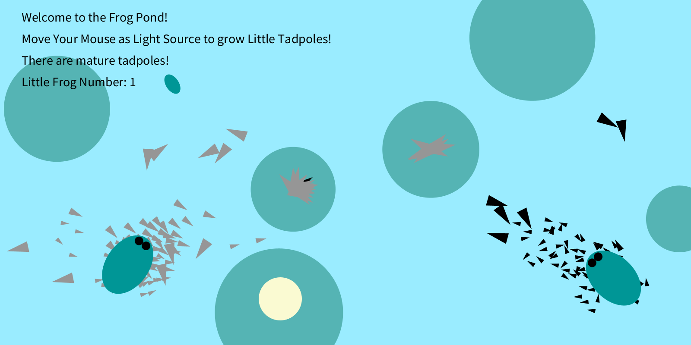
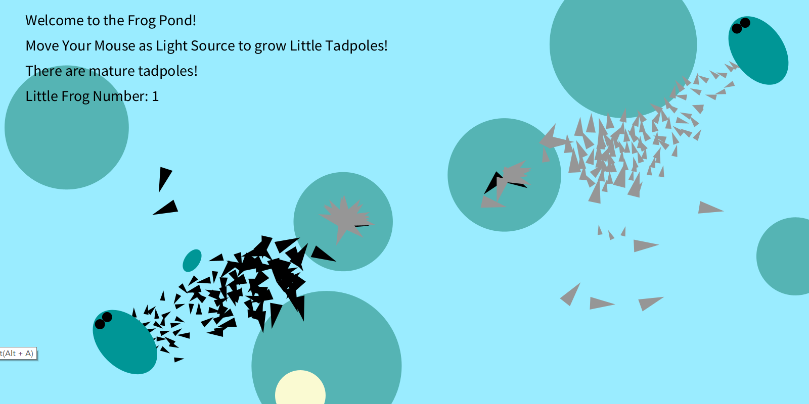
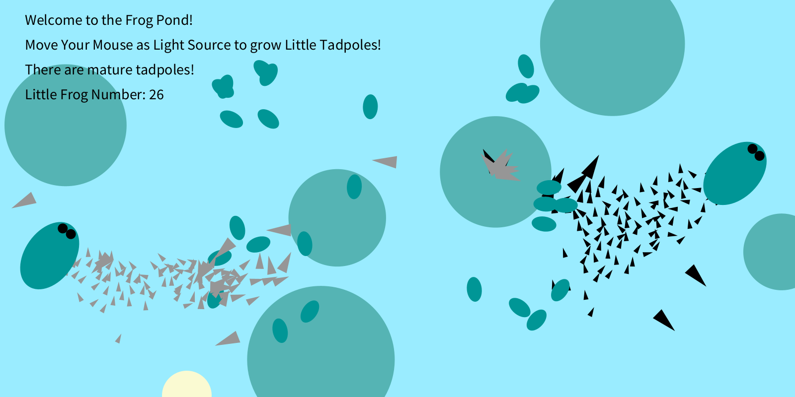
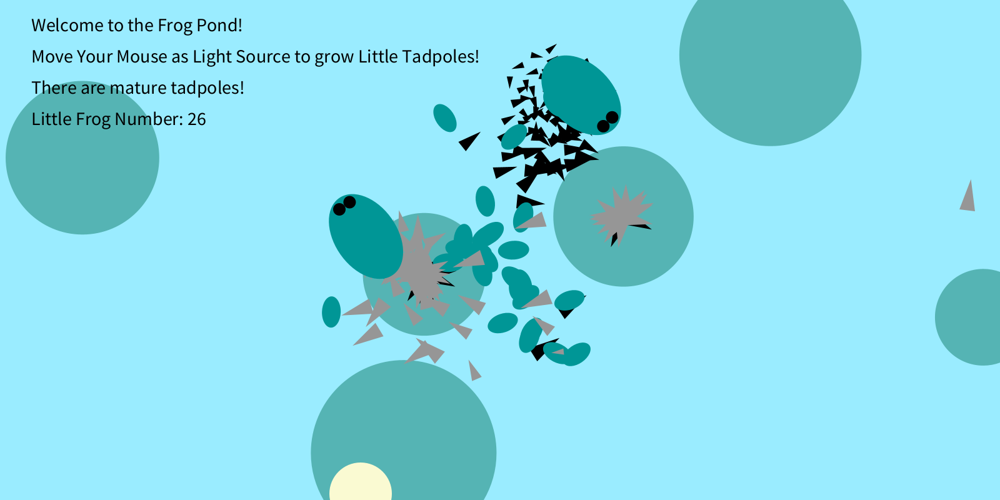
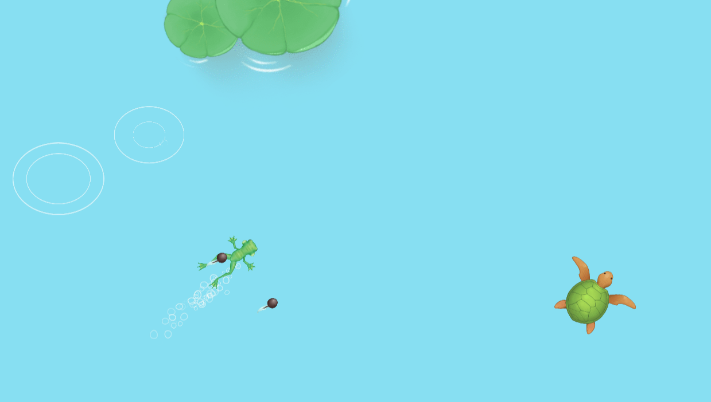

## Title - Frog Pond
## Concept and Description
- This project is a continuation on my previous production assignment —— frog pond. The pond is mainly consisted of 5 elements — the frogs, the tadpoles, the food (algae), the light source, and little frogs. The ecosystem is designed to imitate real-life ecosystem where frogs give birth to tadpoles and tadpoles grow into frogs. 
- The ecosystem mainly follows the several rules:
  - Frogs bear tadpoles while they are swimming
  - Tadpoles Frogs bear tadpoles while they are swimming
  - Tadpoles seek and arrive at frogs 
  - Tadpoles are attracted by algae (food), and speed is affected by hunger level
  - Tadpoles share a behaviour of flocking (separation)
  - Tadpoles grow bigger after eating
  - Tadpoles die if they do not have enough food (determined the lifespan parameter)
  - Tadpoles become little frogs when having enough food and receiving light (determined by the growLevel parameter)
## Presentation
https://docs.google.com/presentation/d/1LlXn905VM9M5R8NAWXXgSRiiFyjSZy4tYqDzEGHQdfE/edit#slide=id.p
## Screenshots and Video

  [Link to video](https://youtu.be/vY3TUtTx1HQ)
  
## How I make it
I create several classes for each component and try to adopt what we learn on class into these classes.
- Frog
  - Big Oval with two black dots
  - 2 Frogs moves with a certain accelerating speed, then stops, then swim again
  - Tadpoles are generated according to the location of the frog through ArrayList
  - Frog notice the boundary of the pond and changes its direction before it reaches the wall using checkEdges()
- Algae
  - Green Cricle
  - 6 algaes are randomly generated with location and mass
  - Algae is set as attractor which attracts tadpoles
  - Larger the mass, larger the attractiveness
- Tadpoles
  - Little triangles
  - Two groups of tadpoles following two frogs, one group is black, another is gray
  - Tadpoles use seek function/arrive function to follow the frogs
  - Tadpoles do flocking - They separate each other when coming too close
  - Tadpoles's scale(size) and growLevel increases when reaching the algae
  - Tadpoles's lifespan decreases as time flows using void live() —— I write "lifespan = lifespan - 0.01", when lifespan is less than 0 and the growLevel isn't enough, the tadpoles will be removed from the ArrayList and they are dead
- Light Source
  - Yellow Circle
  - Play can control the movement of lightsource using mouse
- Little Frog
  - Small Oval
  - Moves similarly to frogs
  - When light source touches the tadpoles with high growLevel, the tadpole is removed from list, and little frog is added to a new list. The location is the same as the orginal tadpoles.
- Legend
  - Using text, the screen shows the mouse intructions, whether there are mature tadpoles (whose growLevel is enough for growing into little frogs), and the number of little frogs 

## Problems
- I firstly try to use Boolean statement to check whether the Tadpoles are dead. However, I find a simpler way using the life span parameter and uses the remove() function to realize the death.
- After figuring out how remove() could work on ArrayList. I find a lot of my previous concerns become easy. I used to worry how to turn the tadpoles into new little frogs. Now I find that it is just a trick of removing elements from the tadpole list and adding new elements into the little frog list.
- The movement of frogs are set quite inflexibly because I want to imitate how frog swims. They are the highest-level creature so that they won't be affected by the tadpoles and food. And sometimes the random funciton makes the little frogs swim extremely fast. This is what I could improve in the future. 

## Interesting Discorvery
- The location and size of the food really matters! Sometimes the algae are separate and small. It takes a long time for tadpoles to grow big as they just die before they grow. However, sometimes the algae are big and close to each other. Therefore, tadpoles could have enough time eating and growing, and the number of little frogs turn out to be amazing.

## Inspiration Source
- The frog and tadpole idea is inspired by a small game called "Summon the Dragon". The game is just like the classic Sprout games. You start as tadpoles, and you merge with other tadpoles to turn into a frog. Then frog turns to fish, fish turns to shark, shark turns to Chinsese dragon, etc..
- 
- [Link to Game]http://www.wesane.com/game/921/
